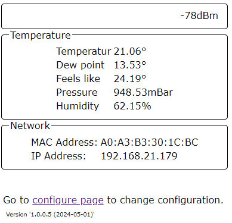
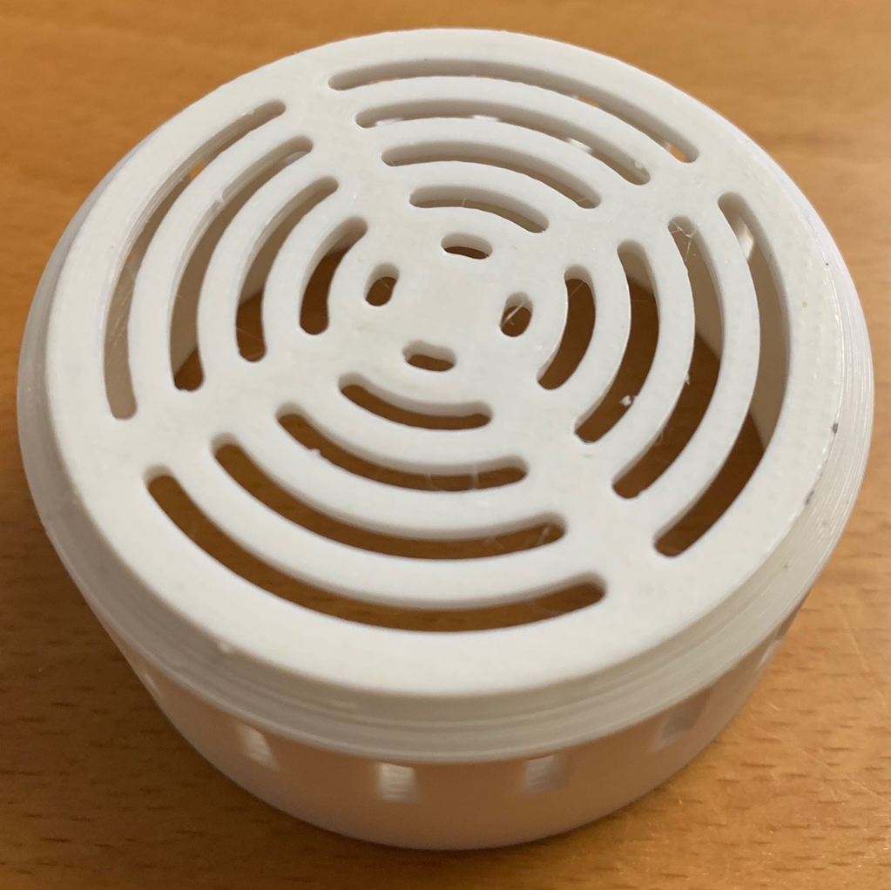
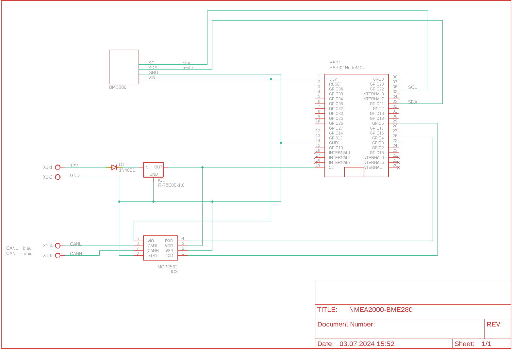

# NMEA2000-BM280 environmental sensor

## Table of contents
- [NMEA2000-BM280 environmental sensor](#nmea2000-bm280-environmental-sensor)
  - [Table of contents](#table-of-contents)
  - [Description](#description)
  - [Schema](#schema)
  - [NMEA 2000](#nmea-2000)
  - [Librarys](#librarys)
  - [Required hardware](#required-hardware)
  - [Configuration](#configuration)
    - [NMEA 2000 Settings](#nmea-2000-settings)
      - [Instance](#instance)
      - [SID](#sid)
    - [Temperatur source](#temperatur-source)
    - [Humidity source](#humidity-source)
  - [WiFi](#wifi)
    - [Default Password](#default-password)
    - [Default IP address](#default-ip-address)
    - [OTA](#ota)
    - [Configuration options](#configuration-options)
  - [Blinking code](#blinking-code)
  - [Reset](#reset)

## Description
This device measures temperature, humidity, and air pressure. The dew point and perceived temperature are also calculated. The sensor used is a BM280. The values are transmitted as NMEA 2000 messages via an NMEA bus. Device configuration is done through a website, and real-time values can also be viewed on a website in addition to the NMEA bus. On the configuration page, there is a link available for convenient firmware updates.

the BME280 is a versatile environmental sensor that provides accurate measurements of temperature, humidity, and barometric pressure.
- Temperatures ranging from -40°C to +85°C with a high degree of accuracy
- relative humidity in the range of 0% to 100%
- pressure sensor data is in hPa (hectopascals) within the range of 300 hPa to 1100 hPa at temperatures from 0°C to 65°C. The absolute accuracy for pressure measurement is approximately ±1 hPa
  

In the \stl directory are two STL files. These can be used to print an appropriate housing on a 3D printer.

## Schema

## NMEA 2000
Depending on the temperature source, one of the following PNGs are sent

- 130310, // Environmental Parameters - DEPRECATED
- 130312, // Temperature - DEPRECATED
- 130316, // Temperature, Extended Range

For humidity the following PGN is sent
- 130313, // Humidity

and for pressure
- 130314, // Pressure

## Librarys
- [Adafruit_BME280_Library](https://github.com/adafruit/Adafruit_BME280_Library)
- NMEA2000
- NMEA200_ESP
- [AsyncTCP](https://github.com/dvarrel/AsyncTCP)
- [ESPAsyncWebServer](https://github.com/me-no-dev/ESPAsyncWebServer)
- [IotWebConf](https://github.com/minou65/IotWebConf)
- [IotWebConfAsync](https://github.com/minou65/IotWebConfAsync)
- [IotWebRoot](https://github.com/minou65/IotWebRoot)

## Required hardware

## Configuration
### NMEA 2000 Settings

#### Instance
This should be unique at least on one device. May be best to have it unique over all devices sending this PGN. A total of 5 instances are occupied by the device. Starting with the number set here.

#### SID
Sequence identifier. In most cases you can use just 255 for SID. The sequence identifier field is used to tie different PGNs data together to same sampling or calculation time.

### Temperatur source
One of the following temperature sources can be selected
- Sea water temperature
- Outside temperature
- Inside temperature
- Engine room temperature
- Main cabin temperature
- Live well temperature
- Bait well temperature
- Refrigeration temperature
- Heating system temperature
- Freezer temperature
- Exhaust gas temperature
- Shaft seal temparature

### Humidity source
can be one of the following location
- inside
- outside
- unknown

## WiFi
### Default Password 
When not connected to an AP the default password is 123456789

### Default IP address
When in AP mode, the default IP address is 192.168.4.1

### OTA
OTA is enabled, use default IP address or if connected to a AP the correct address.
Port is the default port.

### Configuration options
After the first boot, there are some values needs to be set up.
These items are maked with __*__ (star) in the list below.

You can set up the following values in the configuration page:

-  __Thing name__ - Please change the name of the device to
a name you think describes it the most. It is advised to
incorporate a location here in case you are planning to
set up multiple devices in the same area. You should only use
english letters, and the "_" underscore character. Thus, must not
use Space, dots, etc. E.g. `lamp_livingroom` __*__
- __AP password__ - This password is used, when you want to
access the device later on. You must provide a password with at least 8,
at most 32 characters.
You are free to use any characters, further more you are
encouraged to pick a password at least 12 characters long containing
at least 3 character classes. __*__
- __WiFi SSID__ - The name of the WiFi network you want the device
to connect to. __*__
- __WiFi password__ - The password of the network above. Note, that
unsecured passwords are not supported in your protection. __*__

## Blinking code
Prevoius chapters were mentioned blinking patterns, now here is a
table summarize the menaning of the blink codes.

- __Rapid blinking__ (mostly on, interrupted by short off periods) -
Entered Access Point mode. This means the device create an own WiFi
network around it. You can connect to the device with your smartphone
(or WiFi capable computer).
- __Alternating on/off blinking__ - Trying to connect the configured
WiFi network.
- __Mostly off with occasional short flash__ - The device is online.

## Reset
When CONFIG_PIN is pulled to ground on startup, the Thing will use the initial
password to buld an AP. (E.g. in case of lost password)

Reset pin is GPIO 13
